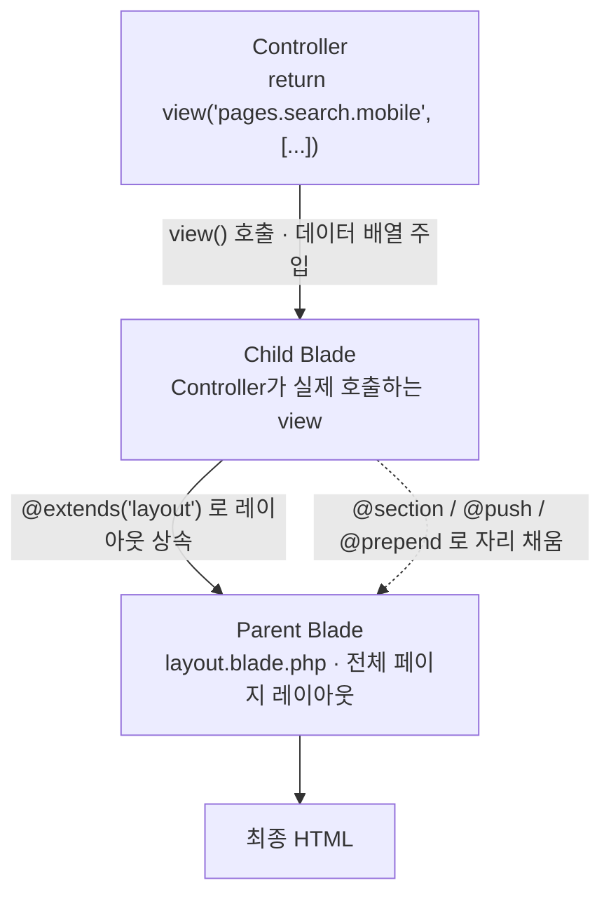
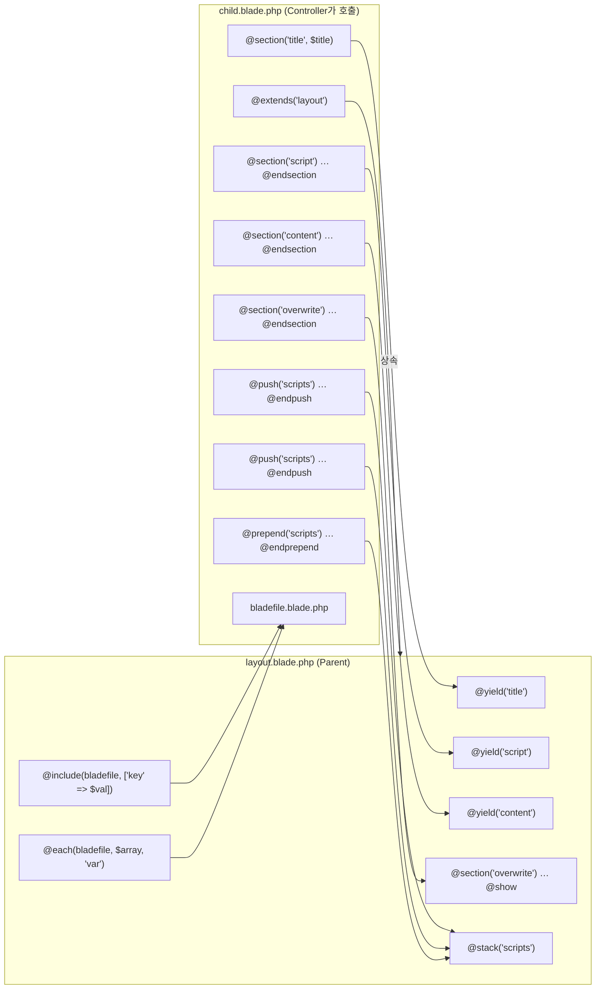

# Laravel Blade 상호작용 가이드

> [!abstract] 이 문서의 범위
> Blade 템플릿에서 **누가 누구를 채워주는가**(parent ↔ child), **어떤 값이 어떤 타입으로 넘어가는가**(component props)를 중심으로 정리한 레퍼런스. 원본은 손으로 그린 다이어그램이며, 여기서는 관계를 텍스트/표/Mermaid로 명시해 검색·인용이 가능하도록 재구성했다.

---

## 1. 렌더링 파이프라인 개요

Blade의 상속은 "parent가 child를 부른다"가 아니라 **child가 parent를 선언(`@extends`)하고, parent의 빈 자리(`@yield`)를 child가 채운다**는 방향이다. Controller가 호출하는 view는 항상 **child** 쪽이다.



### 1.1 진입점이 되는 Controller 예시

```php
return view("pages.search.{$device->value}", [
    'title'        => BuildTitle::get($this),
    'asisSession'  => $this->asisSession,
    'brandData'    => $this->brandData->all(),
    'categoryData' => $this->categoryData->category()->subCategory()->get(),
    'searchParams' => !empty($request->toArray()) ? $request->toArray() : ['q' => null],
    'searchResult' => $searchResult,
    'device'       => $device,
]);
```

여기서 넘긴 키(`title`, `searchResult` 등)는 **child blade 안에서 그대로 변수명**(`$title`, `$searchResult`)이 된다. child가 `@extends`로 상속한 parent 레이아웃 안에서도 같은 변수에 접근할 수 있다 — 데이터는 상속 체인 전체에 공유된다.

---

## 2. Parent ↔ Child 디렉티브 대응 관계

### 2.1 요약 표

| Parent 쪽 | Child 쪽 | 결과 |
|---|---|---|
| `@yield('title')` | `@section('title') … @endsection`<br>또는 `@section('title', $value)` | `@yield`의 자리를 child의 `@section` 내용이 메운다. 값이 짧으면 두 번째 인자로 한 줄 처리 가능 |
| `@section('x') … @show` | (대응 없음) | child에 같은 이름의 `@section`이 없으면 **parent의 기본 내용이 그대로 출력**된다 |
| `@section('x') … @show` | `@section('x') … @endsection` | child의 내용이 **parent의 내용을 덮어쓴다** |
| `@section('x') … @show` | `@section('x') … @parent … @endsection` | `@parent` 위치에 **parent의 원래 내용이 삽입**된다 (덮어쓰기가 아니라 합성) |
| `@stack('scripts')` | `@push('scripts') … @endpush`<br>`@prepend('scripts') … @endprepend` | `@push`는 스택 **뒤에** 붙고, `@prepend`는 스택 **앞에** 붙는다. 여러 번 호출하면 순서대로 누적 |
| `@include(file, [k => v])` | `file.blade.php` | 해당 blade 파일을 그 자리에 그대로 렌더링. `[k => v]`로 값 전달 |
| `@each(file, $array, 'var')` | `file.blade.php` (배열 길이만큼 반복) | `$array`의 각 요소가 순차적으로 `$var`에 대입되어 반복 렌더링 |

### 2.2 구조화 데이터 (AI/스크립트 파싱용)

```yaml
blade_pair_rules:
  - parent: "@yield(name)"
    child: "@section(name) ... @endsection | @section(name, value)"
    behavior: fill
    note: "child가 없으면 @yield 자리는 빈 문자열"

  - parent: "@section(name) ... @show"
    child: null
    behavior: fallback
    note: "parent의 기본 내용 출력"

  - parent: "@section(name) ... @show"
    child: "@section(name) ... @endsection"
    behavior: overwrite

  - parent: "@section(name) ... @show"
    child: "@section(name) ... @parent ... @endsection"
    behavior: merge
    note: "@parent 토큰 위치에 parent 내용 삽입"

  - parent: "@stack(name)"
    child: "@push(name) ... @endpush"
    behavior: append

  - parent: "@stack(name)"
    child: "@prepend(name) ... @endprepend"
    behavior: prepend

  - parent: "@include(file, data)"
    child: "file.blade.php"
    behavior: inline_render

  - parent: "@each(file, array, varName)"
    child: "file.blade.php"
    behavior: loop_render
```

### 2.3 관계 다이어그램



### 2.4 케이스별 코드 예제

#### (a) `@yield` ↔ `@section` — 가장 기본

```blade
{{-- layout.blade.php --}}
<html>
<head>
    <title>@yield('title')</title>
    @yield('script')
</head>
<body>
    @yield('content')
</body>
</html>
```

```blade
{{-- pages/search/mobile.blade.php --}}
@extends('layout')

@section('title', $title)   {{-- 한 줄 형태 --}}

@section('script')
    <script>console.log('search page');</script>
@endsection

@section('content')
    <div>검색 결과 {{ count($searchResult) }}건</div>
@endsection
```

#### (b) `@show` — parent가 기본값을 갖는 경우

```blade
{{-- layout.blade.php --}}
@section('sidebar')
    <aside>기본 사이드바</aside>
@show
```

- child에 `@section('sidebar')`가 **없으면** → `기본 사이드바` 출력
- child에 `@section('sidebar') … @endsection`이 **있으면** → child 내용으로 **교체**

#### (c) `@parent` — 덮어쓰기 대신 합성

```blade
{{-- child --}}
@section('sidebar')
    @parent                      {{-- 여기에 parent의 "기본 사이드바"가 들어온다 --}}
    <aside>추가 메뉴</aside>
@endsection
```

출력:

```html
<aside>기본 사이드바</aside>
<aside>추가 메뉴</aside>
```

> [!tip] `@show` vs `@endsection`
> `@show`는 "정의하고 **즉시 그 자리에 출력**", `@endsection`은 "정의만 하고 출력은 `@yield`에 위임". parent에서 기본값을 주려면 `@show`, child에서 값을 채우기만 하려면 `@endsection`.

#### (d) `@stack` / `@push` / `@prepend` — 스크립트 누적

```blade
{{-- layout.blade.php --}}
<body>
    @yield('content')
    @stack('scripts')   {{-- 여기에 모든 push/prepend가 모인다 --}}
</body>
```

```blade
{{-- child 또는 include된 partial, component 어디서든 --}}
@push('scripts')
    <script src="/js/chart.js"></script>
@endpush

@push('scripts')
    <script>initChart();</script>   {{-- 위 push 뒤에 붙음 --}}
@endpush

@prepend('scripts')
    <script src="/js/jquery.js"></script>   {{-- 스택 맨 앞으로 --}}
@endprepend
```

최종 순서: `jquery.js` → `chart.js` → `initChart()`

#### (e) `@include` 계열

```blade
@include('partials.card', ['item' => $product, 'showPrice' => true])

@includeIf('partials.banner', ['ad' => $ad])           {{-- 파일 없으면 조용히 스킵 --}}
@includeWhen($user->isAdmin(), 'partials.admin-tools') {{-- 조건 true일 때만 --}}
@includeUnless($user->isAdmin(), 'partials.notice')    {{-- 조건 false일 때만 --}}
```

#### (f) `@each` — 배열 반복 렌더링

```blade
@each('partials.row', $searchResult, 'row', 'partials.empty')
```

- `$searchResult`의 각 요소가 `partials/row.blade.php` 안에서 `$row`가 된다
- 4번째 인자는 배열이 비었을 때 렌더링할 뷰(선택)

---

## 3. 분기와 반복

### 3.1 조건문

```blade
@if ($count > 10)
    많음
@elseif ($count > 0)
    적음
@else
    없음
@endif

@isset($searchParams['q'])
    검색어: {{ $searchParams['q'] }}
@endisset

@empty($searchResult)
    결과가 없습니다.
@endempty
```

### 3.2 반복문

```blade
@foreach ($items as $item)
    {{ $item->name }}
@endforeach

@forelse ($items as $item)
    {{ $item->name }}
@empty
    {{-- $items가 비었을 때만 실행 --}}
    항목이 없습니다.
@endforelse
```

### 3.3 `$loop` 객체

반복문 안에서 자동으로 생성되는 객체.

| 프로퍼티 | 의미 |
|---|---|
| `$loop->index` | 인덱스, `0`부터 |
| `$loop->iteration` | 몇 번째 반복인지 (표시용), `1`부터 |
| `$loop->remaining` | 앞으로 남은 횟수 |
| `$loop->count` | 총 반복 횟수 |
| `$loop->first` | 첫 반복이면 `true` |
| `$loop->last` | 마지막 반복이면 `true` |
| `$loop->even` / `$loop->odd` | 짝수/홀수 번째면 `true` |
| `$loop->depth` | 중첩 깊이 |
| `$loop->parent` | 중첩 반복문에서 **상위 루프의 `$loop`** |

```blade
@foreach ($categories as $category)
    @foreach ($category->items as $item)
        <tr class="{{ $loop->even ? 'bg-gray-50' : '' }}">
            <td>{{ $loop->parent->iteration }}-{{ $loop->iteration }}</td>
            <td>{{ $item->name }}</td>
        </tr>
        @if ($loop->last)
            <tr><td colspan="2">총 {{ $loop->count }}건</td></tr>
        @endif
    @endforeach
@endforeach
```

### 3.4 `@once`

반복문이나 여러 번 호출되는 컴포넌트 안에 있어도 **딱 한 번만 렌더링**된다. 주로 컴포넌트가 의존하는 JS/CSS를 한 번만 로드할 때 쓴다.

```blade
@once
    @push('scripts')
        <script>console.log('이 스크립트는 페이지당 한 번만 로드됩니다.');</script>
    @endpush
@endonce
```

### 3.5 인증 분기

```blade
@auth
    {{ auth()->user()->name }} 님 로그인 중
@endauth

@guest
    로그인이 필요합니다.
@endguest
```

---

## 4. 데이터 · 디버깅 · 환경

### 4.1 폼 관련

```blade
<form method="POST" action="{{ route('products.update', $product) }}">
    @csrf
    @method('PUT')   {{-- PATCH / DELETE 도 동일 --}}
    ...
</form>
```

HTML `<form>`은 `GET`/`POST`만 지원하므로, `@method`가 hidden input(`_method`)을 만들어 라우터가 PUT/PATCH/DELETE로 인식하게 한다. 반드시 `<form>` **안쪽**에 적는다.

### 4.2 PHP 배열 → JS

```blade
<script>
    const data = @json($searchResult);
    const params = @json($searchParams, JSON_PRETTY_PRINT);
</script>
```

### 4.3 디버깅

| 디렉티브 | 동작 |
|---|---|
| `@dd($var)` | `@php dd($var); @endphp`와 동일. 출력 후 **실행 중단** |
| `@dump($var)` | 출력하고 **계속 실행** |

### 4.4 환경 분기

`.env`의 `APP_ENV` 값(`app()->environment()`)으로 분기한다.

```blade
@env('local')
    로컬 환경 전용 디버그 툴바
@endenv

@env(['staging', 'production'])
    알파 또는 프로덕션 공통 스크립트
@endenv

@production
    <script src="https://analytics.example.com/tag.js"></script>
@endproduction
```

`@production`은 `@env('production')`의 축약형이다.

---

## 5. CSS · Style · JS

### 5.1 `@vite`

```blade
@vite(['resources/css/app.css', 'resources/js/app.js'])
```

- 구버전 Laravel Mix의 `mix()`를 대체하는 에셋 로더
- `vite.config.js`의 `laravel({ input: [...] })`에 경로를 등록해 두어야 한다
- **dev/prod를 자동 판별**: dev면 Vite dev 서버 경로를, prod면 `public/build/manifest.json`을 참조해 해시된 빌드 파일을 가져온다

### 5.2 `@style` — 조건부 인라인 스타일

boolean 값에 따라 스타일을 붙인다.

```blade
<div @style([
    'background-color: red' => $isCritical,
    'font-weight: bold'     => true,
    'color: gray'           => !$isCritical,
])>
    위험 알림
</div>
```

### 5.3 `@class` — 조건부 CSS 클래스

`@style`의 class 버전. 문자열만 있으면 무조건 추가, `'클래스' => 조건` 형태면 조건부 추가.

```blade
<div @class([
    'p-4',                          {{-- 무조건 추가 --}}
    'font-bold'     => $isActive,
    'text-red-500'  => $isError,
])>
    내용
</div>
```

---

## 6. Blade Component

```bash
php artisan make:component Alert
# → app/View/Components/Alert.php
# → resources/views/components/alert.blade.php
```

사용:

```blade
<x-alert type="danger" :data="$data" />
<x-alert> 내용이 있는 형태 </x-alert>
```

### 6.1 `@props` 와 `$attributes`

`@props`는 컴포넌트 blade **최상단**에서 받을 데이터를 선언한다. 기본값 지정 가능.

```blade
{{-- resources/views/components/alert.blade.php --}}
@props([
    'type' => 'info',   {{-- 기본값 있음 --}}
    'title',            {{-- 기본값 없음 (필수처럼 취급) --}}
])

<div {{ $attributes->merge(['class' => "alert alert-{$type}"]) }}>
    <strong>{{ $title }}</strong>
    {{ $slot }}
</div>
```

> [!important] 핵심 규칙
> `@props`에 **선언된** 이름은 변수(`$type`)로 들어오고 **`$attributes`에서는 제거**된다.
> `@props`에 **선언되지 않은** 나머지 속성만 `$attributes`에 남는다.

### 6.2 `@aware` — 부모 컴포넌트의 props 상속

부모가 컴포넌트일 때, 부모의 `@props`에 정의된 값을 **자식에게 명시적으로 넘기지 않아도** 자식이 복사해 온다. 상위 클래스 프로퍼티 참조와 비슷하지만 **부모 값을 바꿀 수는 없다**(읽기 전용 복사).

```blade
{{-- 부모: components/menu.blade.php --}}
@props(['color' => 'gray'])
<ul {{ $attributes }}>{{ $slot }}</ul>
```

```blade
{{-- 자식: components/menu/item.blade.php --}}
@aware(['color' => 'gray'])
<li class="text-{{ $color }}-600">{{ $slot }}</li>
```

```blade
{{-- 사용처: item마다 color를 적어줄 필요가 없다 --}}
<x-menu color="purple">
    <x-menu.item>홈</x-menu.item>
    <x-menu.item>검색</x-menu.item>
</x-menu>
```

### 6.3 `$slot` — 기본 슬롯

`@props`/`$attributes`와 동작 원리는 같지만, **큰 HTML 덩어리**를 통째로 받아 넣는 용도.

```blade
{{-- 호출부 --}}
<x-child><b>이 부분</b>이 $slot을 대체합니다</x-child>
```

```blade
{{-- components/child.blade.php --}}
<div>{{ $slot }}</div>
```

### 6.4 named slot — 여러 덩어리 받기

`<x-slot:var>` 로 정의한 내용은 컴포넌트 안에서 `$var`가 된다.

```blade
{{-- 호출부 --}}
<x-child>
    <x-slot:title>
        <h3>알림 메시지</h3>
    </x-slot:title>

    <x-slot:body>
        본문 내용입니다.
    </x-slot:body>
</x-child>
```

```blade
{{-- components/child.blade.php --}}
<div>
    <div>{{ $title }}</div>
    <div>{{ $body }}</div>
</div>
```

### 6.5 `$attributes` (ComponentAttributeBag)

연관배열처럼 보이지만 실제로는 `Illuminate\View\ComponentAttributeBag` **객체**다.

#### (1) 기본 — 그대로 펼치기

```blade
{{-- 호출: <x-alert id="error-box" class="mt-4" data-role="alert" /> --}}
<div {{ $attributes }}>
{{-- 결과: <div id="error-box" class="mt-4" data-role="alert"> --}}
```

#### (2) `merge()` — 컴포넌트 기본 속성과 병합

```blade
<div {{ $attributes->merge(['class' => 'alert alert-info']) }}>
```

`class`와 `style`은 **값이 이어붙고**, 나머지 속성은 호출부 값이 우선한다.

#### (3) `filter()` — 속성 골라내기

```blade
<div {{ $attributes->filter(fn ($value, $key) => str_starts_with($key, 'data-')) }}>

{{-- 축약형도 있다 --}}
<div {{ $attributes->whereStartsWith('data-') }}>
<div {{ $attributes->whereDoesntStartWith('data-') }}>
```

#### (4) `has()` / `get()` — 존재 확인과 기본값

```blade
@if ($attributes->has('onclick'))
    <p>이 버튼은 클릭 이벤트가 설정되어 있습니다.</p>
@endif

{{ $attributes->get('id', 'default-id') }}   {{-- id가 없으면 기본값 출력 --}}
```

---

## 7. 컴포넌트로 값 전달할 때의 타입 규칙

`:` prefix 유무가 **"문자열 리터럴이냐, PHP 표현식이냐"**를 가른다.

| 호출부 표기 | 컴포넌트가 받는 값 | 설명 |
|---|---|---|
| `type="danger"` | `(string) "danger"` | PHP 파서 개입 없이 정적 문자열 그대로 전달 |
| `:type="'danger'"` | `(string) "danger"` | PHP 파서가 표현식 `'danger'`를 평가해 전달 |
| `:type="$strDanger"` | `(string) "danger"` | 변수 값 전달 (`$strDanger = "danger"` 인 경우) |
| `count="5"` | `(string) "5"` | 따옴표 안의 값은 **문자열** |
| `:count="5"` | `(int) 5` | PHP 파서가 정수 리터럴로 평가 |
| `:items="$collection"` | `Collection` 객체 | 배열/객체/컬렉션도 그대로 전달 가능 |
| `:is-active="$user->isAdmin()"` | `(bool)` | 메서드 호출 결과도 평가 |

```blade
@php $strDanger = 'danger'; @endphp

<x-component
    type="danger"          {{-- (string) "danger" --}}
    :type2="$strDanger"    {{-- (string) "danger" --}}
    strcount="5"           {{-- (string) "5"      --}}
    :numcount="5"          {{-- (int) 5           --}}
/>
```

```blade
{{-- 받는 쪽 --}}
@props(['type' => 'default', 'strcount', 'numcount'])
```

> [!warning] 자주 나오는 실수
> `count="5"`로 넘기고 컴포넌트 안에서 `$count === 5`로 비교하면 **false**다(`"5" !== 5`). 숫자·불리언·배열은 `:` 를 붙여 넘긴다.
> 특히 `active="false"`는 **비어있지 않은 문자열**이라 `if ($active)`에서 true가 된다. `:active="false"`로 써야 한다.

---

## 8. 빠른 색인

| 하고 싶은 것 | 쓸 디렉티브 |
|---|---|
| 레이아웃에 자리 만들기 | `@yield` |
| 레이아웃 자리 채우기 | `@section … @endsection` |
| 레이아웃에 기본값 두기 | `@section … @show` |
| 기본값 유지하며 덧붙이기 | child에서 `@parent` |
| 여러 곳에서 스크립트 모으기 | `@stack` + `@push` / `@prepend` |
| 파일 조각 끼워넣기 | `@include`, `@includeIf`, `@includeWhen`, `@includeUnless` |
| 배열만큼 부분뷰 반복 | `@each` |
| 중복 없이 한 번만 출력 | `@once` |
| 재사용 UI 만들기 | `<x-component>` + `@props` / `$slot` / `$attributes` |
| 부모 컴포넌트 값 물려받기 | `@aware` |
| 조건부 class / style | `@class` / `@style` |
| 에셋 로드 | `@vite` |

---

## 관련 노트

- [[Laravel 뷰 컴포저와 데이터 공유]]
- [[Vite 설정과 에셋 빌드 파이프라인]]
- [[Blade 컴포넌트 vs Livewire 컴포넌트]]
